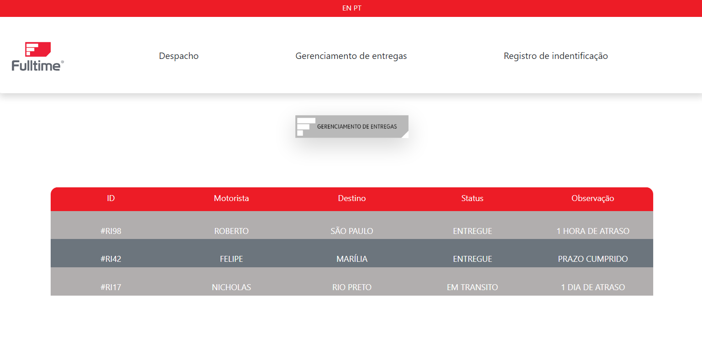
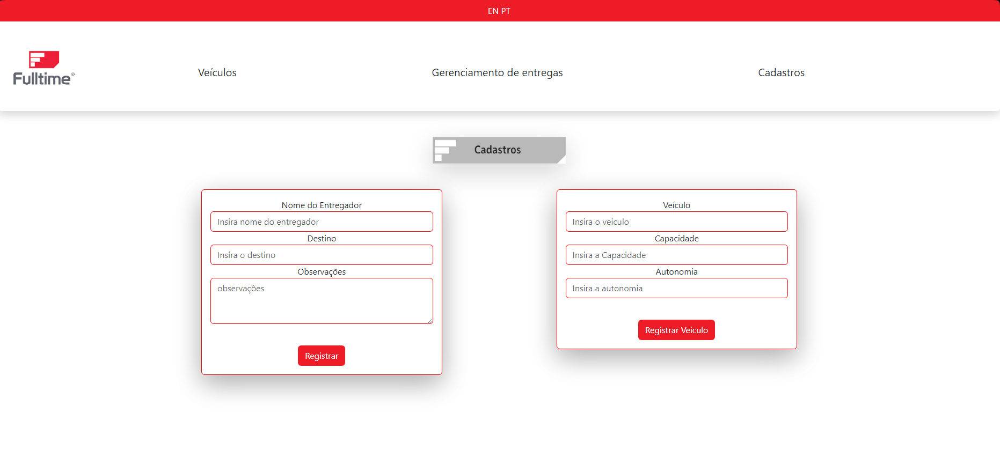
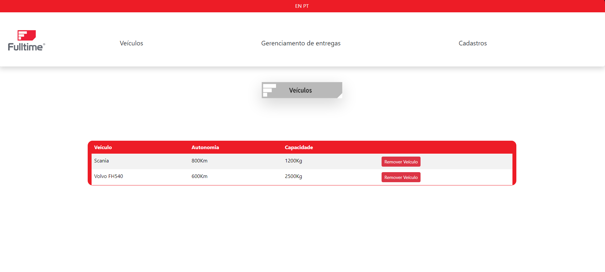

# Projeto FullMap adaptado para Vue.js

## Unimar - Análise e Desenvolvimento de Sistemas - Turma-A 3º Termo

### Membros do Grupo
* Enrico Bernardes Perin - RA: 1959795
* Gabriel de Oliveira Mendes - RA: 1960453 
* Gabriel Medina Garcia - RA: 1975483
* João Pedro Almeida dos Santos - RA: 1962987

## Descrição do Projeto: 

 #### ***Projeto com proposito de otimizar entregas, com foco na capacidade dos veículos da frota, horários de entrega e verificação de horário de funcionamento dos estabelecimentos, de forma a melhorar a logística da empresa.***

## Imagens: 

### *Gerenciamento de Entregas*

#### Mostra o status atual de cada entrega, com botões para confirmar e cancelar cada entrega.

### *Cadastros*

#### Serve para cadastrar novas entregas e novos veículos.

### *Menu de Despacho*

#### Mostra todos os veículos disponiveis, com botão para remover o veículo quando não estiver mais disponível.

